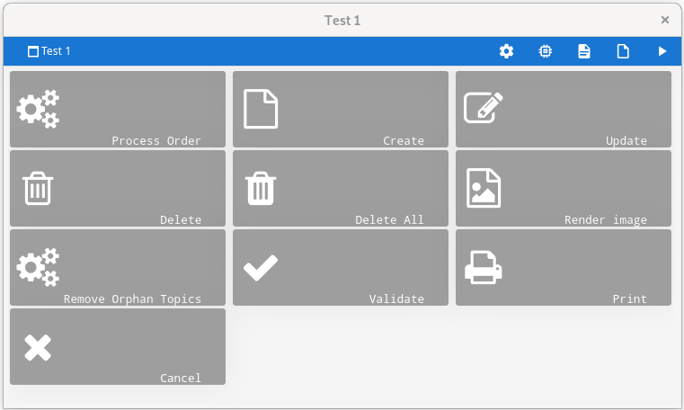
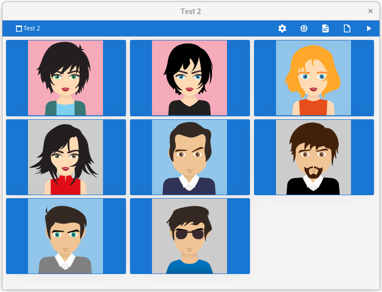

# Dynamic Menu Demo

## Description

This Genero BDL demo illustrates how to use the MENU dialog instruction to
display a list of options defined at runtime.

## Prerequisites

* Latest Genero version
* GNU Make

## Compilation from command line

1. make clean all
2. make run
